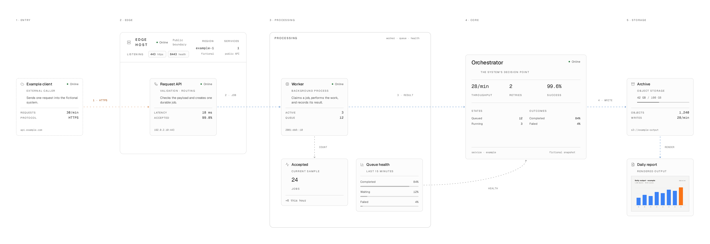
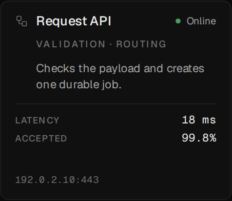
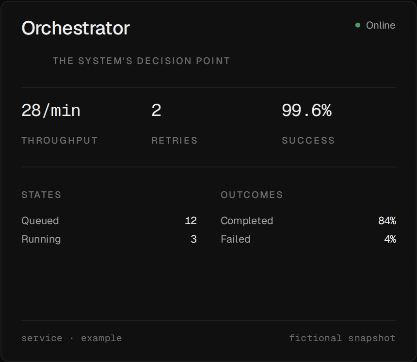
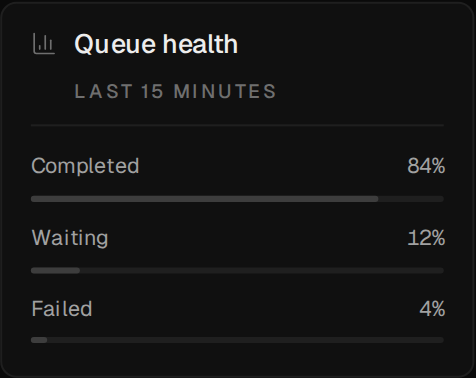
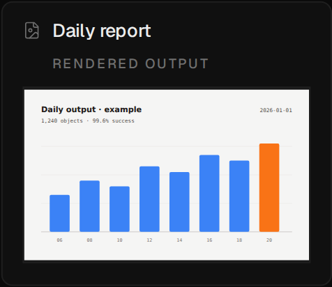
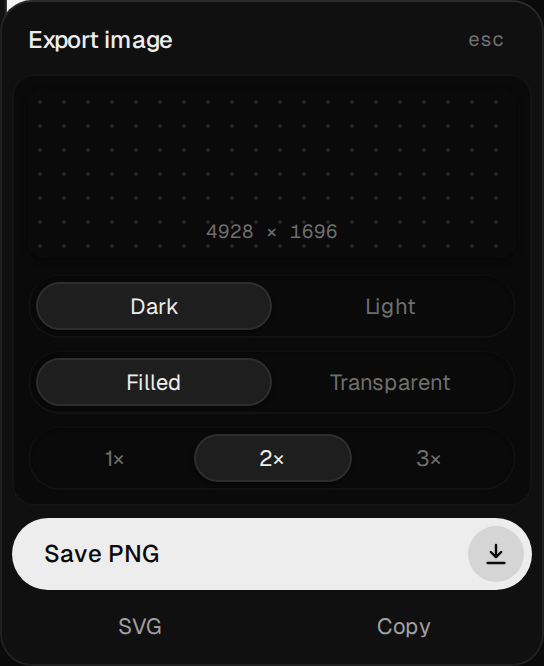
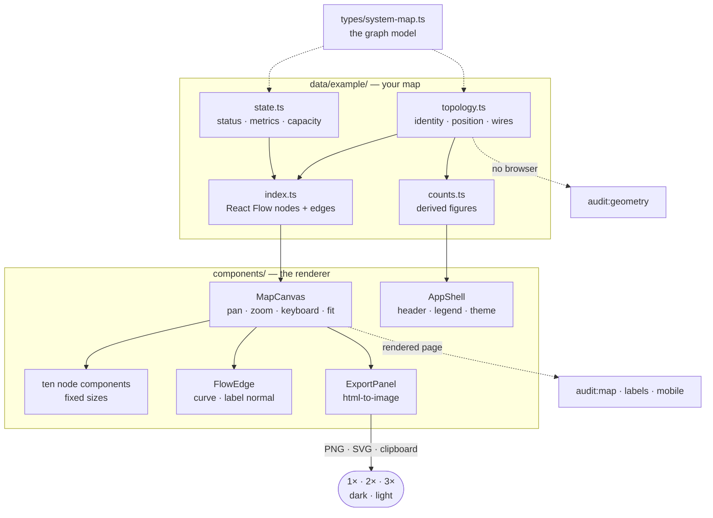
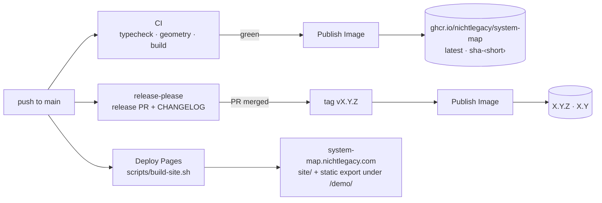

<div align="center">

# System Map

**Hand-placed system maps that people can actually follow.**
<br>
Typed data in, a React Flow canvas out: cards that say what they are, wires that
say what they carry, and the whole graph exported as PNG or SVG in either theme.

[](https://nextjs.org)
[](https://reactflow.dev)
[](types/system-map.ts)
[](package.json)
[](#docker)
[](LICENSE)

[Live demo](https://system-map.nichtlegacy.com/demo/example/) • [Website](https://system-map.nichtlegacy.com) • [Overview](#overview) • [Quick start](#quick-start) • [Make it yours](#make-it-yours) • [Cards and wires](#cards-and-wires) • [Export](#export-and-controls) • [Audits](#audits) • [Architecture](#architecture) • [Deployment](#deployment)

<a href="https://system-map.nichtlegacy.com/demo/example/">
  <picture>
    <source media="(prefers-color-scheme: dark)" srcset=".github/images/readme-dark.png">
    
  </picture>
</a>

</div>

## Overview

Most architecture diagrams are drawn once in a whiteboard tool and rot the week
after. Auto-layout tools stay current but lay the graph out for the algorithm,
not for the reader. System Map sits between the two: the positions are yours,
written as typed data you can review in a pull request, and a set of audits
checks that the result stays readable — no wire through a card, no label on a
stroke, no page that scrolls sideways on a phone.

The project stays deliberately:

- **hand-placed** — no layout engine. You decide where the eye starts and where
  it ends.
- **data, not an editor** — a map is four TypeScript files. There is no canvas
  to click around in and no file format to lose.
- **honest about colour** — every colour has a second cue: status carries a
  word, wires carry a dash pattern, bars print their value.
- **static** — no database, no runtime data source, no analytics, no
  authentication, no telemetry.

> The included map is fictional. It uses `example.com` and IANA-reserved
> documentation addresses (`192.0.2.0/24`, `2001:db8::/32`), so the repository
> can be published or forked without exposing a real network.

## Highlights

- **Ten card kinds, three wire kinds** — from a plain service to the one primary
  card a map is about, a frame for a host, and a card whose body is the output
  itself. See [Cards and wires](#cards-and-wires).
- **Identity apart from state** — names, roles and addresses live in the
  topology; latency, status and throughput live in a separate file, ready to be
  fed by something live.
- **Full-canvas export** — PNG or SVG at 1×, 2× or 3×, dark or light, filled or
  transparent, or straight to the clipboard. The whole graph, not the part on
  screen.
- **Four layout audits** — one reads the data without a browser and runs in CI;
  three measure the rendered page.
- **Keyboard, trackpad and reduced motion** — arrow keys pan, `+` / `-` zoom,
  `0` fits; the drifting wires stop under `prefers-reduced-motion`.
- **Light and dark** — both themes resolve through the same semantic tokens, and
  an export can be either without touching the page theme.
- **A container image** for amd64 and arm64 on GHCR, and a hardened
  [`compose.yaml`](compose.yaml).

## Quick start

Requires **Node.js 22.18** or newer. Nothing else — no database, no account.

```bash
git clone https://github.com/nichtlegacy/system-map.git
cd system-map
npm ci
npm run dev
```

Expected: <http://localhost:3000> shows the landing page, and
<http://localhost:3000/example> the map above. Edit anything in
[`data/example/`](data/example) and the canvas updates on save.

### Docker

Every green CI run on `main` publishes an image to the GitHub Container
Registry; a release adds its version tags.

```bash
docker run --rm -p 3000:3000 ghcr.io/nichtlegacy/system-map:latest
```

The map is compiled into the image, so the published one only ever shows the
example. To serve your own, build from your checkout:

```bash
docker compose up -d --build
```

[`compose.yaml`](compose.yaml) runs the container read-only, with every
capability dropped, `no-new-privileges`, and a 256 MB memory limit. The health
check polls `/` every 30 seconds.

## Make it yours

A map is four files, and each one has one job:

| File | Holds | Changes when |
|---|---|---|
| [`topology.ts`](data/example/topology.ts) | Identities, positions, frames, lanes and wires | The system changes shape |
| [`state.ts`](data/example/state.ts) | Status, latency, capacity — what a live source would provide | The numbers change |
| [`index.ts`](data/example/index.ts) | Merges both into React Flow nodes and edges, with their sizes | You add a card kind to the map |
| [`counts.ts`](data/example/counts.ts) | Every number the page header and legend print, derived from the topology | Never by hand |

A card is an identity with a position; its numbers sit in state under the same
id:

```ts
// topology.ts
export const services: Placed<ServiceIdentity>[] = [
  {
    id: "worker",
    position: { x: 920, y: 240 },
    name: "Worker",
    category: "Background process",
    description: "Claims a job, performs the work, and records its result.",
    host: "2001:db8::10",
    icon: Cpu,
  },
];

// state.ts
export const serviceState: Record<string, ServiceState> = {
  worker: {
    status: "online",
    metrics: [
      { label: "Active", value: "3" },
      { label: "Queue", value: "12" },
    ],
  },
};
```

A wire names both ends, the side of each card it leaves and enters, and what it
carries:

```ts
export const links: FlowLink[] = [
  {
    id: "api-worker",
    stage: 2,
    source: "api",
    target: "worker",
    sourceHandle: "right",
    targetHandle: "left",
    flavor: "data",
    label: "job",
  },
];
```

The full model — every card's fields, label nudges, curvature overrides — is
documented inline in [`types/system-map.ts`](types/system-map.ts).

### A second map

Copy [`data/example/`](data/example) and [`app/example/`](app/example), rename
both, and point the new route at the new folder. Map components never import
from a data folder, so a new map costs a folder and a route and nothing else.

The project name and repository URL live in [`data/site.ts`](data/site.ts).

### With a coding agent

The renderer is [React Flow](https://reactflow.dev) (`@xyflow/react`). If an
agent draws or extends your map, give it the community
[react-flow skill](https://github.com/existential-birds/beagle/tree/main/plugins/beagle-react/skills/react-flow),
which covers custom nodes, handles, edge labels and the viewport:

```bash
npx skills add existential-birds/beagle --skill react-flow
```

Point it at `data/example/` and [`docs/design.md`](docs/design.md), and let the
[audits](#audits) judge the result.

## Cards and wires

Each card kind is a React component with a fixed size, so layouts stay on a grid
and the audits know what they measure. A normal card is 232 × 200, a compact one
232 × 116, the primary card 420 × 364.

<table>
<tr>
<td width="50%"><br><em><b><code>service</code></b> — a running thing: identity, status, two to four metrics, where it lives.</em></td>
<td width="50%"><br><em><b><code>primaryService</code></b> — the one card a map is about gets the room: headline figures, the states work moves through, what came out.</em></td>
</tr>
<tr>
<td width="50%"><br><em><b><code>bars</code></b> — ranked values. Every bar prints its figure; colour is never the only cue.</em></td>
<td width="50%"><br><em><b><code>artefact</code></b> — the output itself, on the normal plate, instead of a metric row describing it.</em></td>
</tr>
</table>

| Kind | Use |
|---|---|
| `service` | A normal running service |
| `primaryService` | The main decision point — one per map |
| `external` | Something outside the system boundary |
| `storage` | A path or capacity-bearing store, with a fill bar |
| `artefact` | The output itself — a report, a render — as a picture |
| `infra` | A host frame with its listeners and facts |
| `cluster` | A labelled frame around related nodes, which a wire can attach to |
| `lane` | A reading-order label across the top |
| `stat` | One derived figure and the step that produced it |
| `bars` | Ranked values with visible numbers |

Wires come in three flavours. Colour and dash pattern come from CSS tokens, not
from the graph data. Hovering or focusing a legend entry lights up that flavour
and dims the rest.

| Flavour | Carries |
|---|---|
| `data` | Payloads and stored records |
| `management` | Control, state and health signals |
| `external` | Anything crossing the system boundary |

Labels sit beside the curve, not on it: `FlowEdge` computes the curve's normal
and takes a side override or a small nudge where the corridor is narrow. The
rules behind all of this — tokens, type, spacing, motion — are in
[`docs/design.md`](docs/design.md).

## Export and controls



The export panel captures an off-screen clone of the whole viewport. The live
view stays still, cards outside the current viewport are included, and a light
export works from a dark page.

- **Format** — PNG or SVG, or a PNG copied to the clipboard (HTTPS or
  localhost only; browsers withhold the clipboard elsewhere).
- **Theme** — dark or light, independent of the page.
- **Background** — the canvas colour, or transparent with pre-composited wire
  colours so lines keep their contrast on any backdrop.
- **Scale** — 1×, 2× or 3×. The example at 2× is about 4900 px across.

| Input | Does |
|---|---|
| Drag, wheel, pinch | Pan and zoom |
| <kbd>Shift</kbd> + wheel | Pan sideways |
| <kbd>←</kbd> <kbd>↑</kbd> <kbd>→</kbd> <kbd>↓</kbd> | Pan |
| <kbd>+</kbd> / <kbd>-</kbd> | Zoom |
| <kbd>0</kbd> | Fit the whole graph |
| <kbd>Esc</kbd> | Close the export panel |

The images in this README and on the landing page come out of that same panel —
see [Regenerating images](#regenerating-images).

<br clear="right">

## Audits

Positions are hand-authored, so the checks measure whether the result is sound;
they never choose a layout.

| Audit | Needs | Fails on |
|---|---|---|
| `audit:geometry` | Nothing — reads `topology.ts` | A wire through a card, two wires on one handle, a card outside its frame, an arc the first view would crop |
| `audit:map` | The running app | Frame containment, card overlap, edge crossings, label collisions, clipped content |
| `audit:labels` | The running app | A label too close to a stroke or a plate, ink spilling past a card, navigation that overflows |
| `audit:mobile` | The running app | Any page that scrolls sideways on a phone, naming the element responsible |

```bash
npm run typecheck
npm run audit:geometry        # no browser; CI runs this on every push
```

The browser audits drive Playwright against `http://127.0.0.1:3000`. Run them
against a production server — `next dev` blocks its dev resources for
`127.0.0.1`, and the page never hydrates:

```bash
npx playwright install chromium   # once
npm run build && npm start

# in a second terminal
npm run audit:map
npm run audit:labels
npm run audit:mobile
```

`audit:map` and `audit:labels` check 2560 × 1440 by default; pass
`-- --vp 1920x1080` or `-- --vp 1440x900` for the other sizes the design is held
to.

## Architecture



The dependency only points one way: components know the graph model, never a
map. That is what lets a second map cost a folder and a route.

### Configuration

There is no runtime configuration. Everything below is read at build time.

| Variable | Default | Used by | Purpose |
|---|---|---|---|
| `SITE_URL` | `http://localhost:3000` | `docker compose build` | Your public URL, passed through as `NEXT_PUBLIC_SITE_URL` |
| `NEXT_PUBLIC_SITE_URL` | `http://localhost:3000` | `npm run build` | Base for the absolute URLs in link previews |
| `HOST_PORT` | `3000` | `compose.yaml` | Port published on the host |
| `STATIC_EXPORT` | unset | `next.config.ts` | `1` writes plain files instead of the standalone server |
| `NEXT_PUBLIC_BASE_PATH` | unset | `next.config.ts` | Serve the app under a sub-path, e.g. `/demo` |

Link previews use absolute URLs, and those are baked into the pages — so set
`SITE_URL` (or `NEXT_PUBLIC_SITE_URL`) before building for your own host:

```bash
SITE_URL=https://maps.example.com docker compose up -d --build
```

## Deployment



- **Container** — [`Dockerfile`](Dockerfile) builds once on the runner's
  platform and ships the same standalone output to amd64 and arm64. The runtime
  stage has no `node_modules` and no npm, runs as `node`, and serves on port
  3000.
- **Releases** — commits follow
  [Conventional Commits](https://www.conventionalcommits.org).
  [release-please](https://github.com/googleapis/release-please) keeps one
  release PR open with the next version and [`CHANGELOG.md`](CHANGELOG.md);
  merging it tags the release and publishes the versioned image.
- **Project page** — [`site/`](site) is a plain HTML landing page. The Pages
  workflow puts it at the root and a static export of the app under `/demo/`.
  Preview both locally with `npm run site`, served on
  <http://localhost:8000>.

### Regenerating images

Every image here is cut from the running app, so it can never show something
the app does not render. With the dev server on port 3000:

| Command | Writes |
|---|---|
| `npm run posters` | `public/posters/` (transparent, for the landing page) and `.github/images/` (solid, for this README) |
| `npm run site:images` | The card and export-panel shots in `site/screenshots/` |
| `npm run social` | The 1200 × 630 link preview and touch icons, for `site/` and `app/` — run `posters` first |

## Project structure

```text
system-map/
├── app/                   # landing page, /example route, icons, link preview
├── components/
│   ├── map/               # canvas, the ten node kinds, FlowEdge, export
│   ├── shell/             # header, legend and edge filter, theme, page frame
│   └── landing/           # hero, spine and reveal pieces of the landing page
├── data/
│   ├── example/           # the fictional map: topology, state, index, counts
│   └── site.ts            # project name and repository URL
├── types/system-map.ts    # the public graph model
├── docs/design.md         # visual and interaction rules
├── public/                # posters and the example's rendered artefact
├── scripts/               # audits, image export, site build
├── site/                  # the project page served on GitHub Pages
└── .github/               # CI, image, release and Pages workflows; README images
```

## What it is not

Not a dashboard, not a diagram editor, not a live monitor. `state.ts` is shaped
like something a live source could fill, but nothing here fetches it. A map is
drawn once, so the next person can find their way without asking you.

## Acknowledgments

- **[React Flow](https://reactflow.dev)** — the canvas, the handles and the
  viewport everything else sits on.
- **[html-to-image](https://github.com/bubkoo/html-to-image)** — the PNG and SVG
  export.
- **[Geist](https://vercel.com/font)** and **[Lucide](https://lucide.dev)** —
  type and icons.
- The token hierarchy and typography were informed by
  [Vercel's published design guidance](https://vercel.com/design.md).

Dependency licenses are listed in
[`THIRD_PARTY_NOTICES.md`](THIRD_PARTY_NOTICES.md).

## License

[MIT](LICENSE). Draw whatever you like with it.
