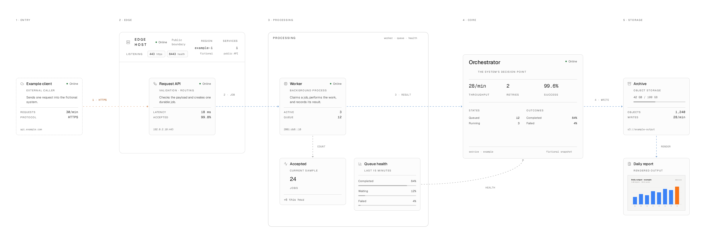

# System Map

A Next.js starter for hand-placed system maps: typed data, cards that say what
they are, wires that say what they carry, and the whole canvas exported as PNG
or SVG in either theme.

<picture>
  <source media="(prefers-color-scheme: dark)" srcset="public/posters/example-dark.png">
  
</picture>

**[Live demo](https://system-map.nichtlegacy.com/demo/example/)** ·
[Project page](https://system-map.nichtlegacy.com)

The included map is fictional. It uses `example.com` and IANA-reserved address
ranges, so the repository can be published or forked without exposing a real
network.

## Quick start

Node.js 22.18 or newer is required.

```bash
npm ci
npm run dev
```

Open <http://localhost:3000> for the landing page and
<http://localhost:3000/example> for the map.

## Docker

Every green CI run on `main` publishes an image to the GitHub Container
Registry; a release adds its version tags.

```bash
docker run --rm -p 3000:3000 ghcr.io/nichtlegacy/system-map:latest
```

`compose.yaml` runs the same image read-only, without capabilities, behind
`HOST_PORT` (default 3000). The map is compiled into the image, so to serve
your own, build from the checkout:

```bash
docker compose up -d --build
```

Link previews use absolute URLs, and those are fixed at build time. Set
`SITE_URL=https://maps.example.com` (or `NEXT_PUBLIC_SITE_URL` for a plain
`npm run build`) to point them at your own host.

## Make it yours

A map is four files in `data/example/`:

| File | Holds |
| --- | --- |
| `topology.ts` | Identities, positions, frames, lanes, and edge definitions |
| `state.ts` | Values that may change: status, latency, capacity |
| `index.ts` | Converts both into React Flow nodes and edges, with sizes |
| `counts.ts` | Every number the page and legend print, derived from the topology |

Copy `data/example/` and `app/example/` when you need a second map. Map
components never import from the data folders, so a new map costs a folder and
a route. The project name and repository URL live in `data/site.ts`.

### With a coding agent

The renderer is [React Flow](https://reactflow.dev) (`@xyflow/react`). If an
agent draws or extends your map, give it the community
[react-flow skill](https://github.com/existential-birds/beagle/tree/main/plugins/beagle-react/skills/react-flow), which covers custom nodes, handles, edge labels and
the viewport:

```bash
npx skills add existential-birds/beagle --skill react-flow
```

Point it at `data/example/` and `docs/design.md`, and let the audits in
[Checks](#checks) judge the result.

## Map vocabulary

The renderer includes ten node kinds:

| Kind | Use |
| --- | --- |
| `service` | A normal running service |
| `primaryService` | The main decision point |
| `external` | Something outside the system boundary |
| `storage` | A path or capacity-bearing store |
| `artefact` | The output itself — a report, a render — as a picture |
| `infra` | A host frame with listeners and facts |
| `cluster` | A labelled frame around related nodes |
| `lane` | A reading-order label |
| `stat` | One derived figure |
| `bars` | Ranked values with visible numbers |

Edges use `data`, `management`, or `external`. Colour and dash patterns come
from CSS tokens rather than graph data.

## Export and controls

The map supports mouse, trackpad, and keyboard navigation. Arrow keys pan,
`+` and `-` zoom, and `0` fits the graph. The export panel writes PNG or SVG at
1x, 2x, or 3x, dark or light, and can copy a PNG on HTTPS or localhost.

`npm run posters` drives that same export panel in a headless browser and
re-cuts the images in `public/posters/` used by the landing page and this
README.

## Checks

```bash
npm run typecheck
npm run audit:geometry   # no browser needed; runs in CI
npm run build
```

With the app running on port 3000:

```bash
npm run audit:map
npm run audit:labels
npm run audit:mobile
```

The geometry audit reads the topology and fails on wires through cards, cards
outside their frames, and arcs the first view would crop. The browser audits
report edge crossings, clipped text, label collisions, labels crowding a card,
navigation overflow, and pages that scroll sideways on a phone. Pass
`--vp 1920x1080` to `audit:map` and `audit:labels` to check other screen sizes.

## Releases and the project page

Commits follow [Conventional Commits](https://www.conventionalcommits.org).
[release-please](https://github.com/googleapis/release-please) keeps a release
PR open with the next version and `CHANGELOG.md`; merging it tags the release
and publishes the versioned image.

The project page in `site/` and a static export of the app under `/demo/` are
deployed to GitHub Pages by `.github/workflows/pages.yml`. Preview both with
`npm run site`, and re-cut the page's detail shots with `npm run site:images`
while the app runs.

`npm run social` renders the 1200 × 630 link preview and the touch icons from
the example's poster, into `site/` for the page and `app/` for the app, which
Next.js turns into the matching meta tags. Run `npm run posters` first when
the map changes.

## Structure

```text
app/                 landing page and example route
components/landing/  hero, spine, and reveal pieces of the landing page
components/map/      canvas, nodes, edges, controls, and export
components/shell/    navigation, theme, legend, and page frame
data/example/        fictional topology and state
data/site.ts         project name and repository URL
docs/design.md       visual and interaction rules
public/              posters and the example's rendered artefact
scripts/             audits, poster and site image export, site build
site/                the project page served on GitHub Pages
types/system-map.ts  public graph model
```

The starter has no analytics, authentication, runtime data source, deployment
target, or credentials.

## License

Source code and project-owned assets are available under the MIT License. See
`THIRD_PARTY_NOTICES.md` for dependency licenses.
